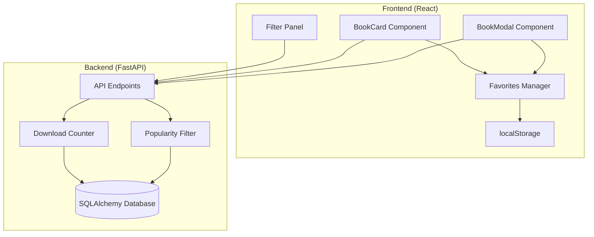

# Design Document: Biblioteca Download Tracking and Favorites System

## Overview

This design implements a comprehensive download tracking and favorites system for the biblioteca app. The system consists of two main components: a server-side download counter that tracks book popularity with time-based filtering, and a client-side favorites manager using localStorage for persistent user preferences.

The design emphasizes performance through atomic database operations, efficient indexing strategies, and graceful error handling for localStorage limitations. The UI integration maintains the existing design language while adding intuitive heart icons and download counters.

## Architecture

### System Components



### Data Flow

1. **Download Tracking**: User clicks download → Frontend calls API → Backend atomically increments counter → Database updated
2. **Favorites Management**: User clicks heart → Favorites Manager updates localStorage → UI reflects change immediately
3. **Popularity Filtering**: User selects time period → API queries database with date range → Results returned sorted by download count
4. **Favorites Filtering**: User activates favorites filter → Frontend filters displayed books using localStorage data

## Components and Interfaces

### Backend Components

#### Download Counter Service

```python
class DownloadCounterService:
    async def increment_download_count(self, book_id: int, session: AsyncSession) -> bool
    async def get_download_count(self, book_id: int, session: AsyncSession) -> int
    async def get_popular_books(self, time_period: str, limit: int, session: AsyncSession) -> List[Book]
```

**Key Design Decisions:**

- Uses SQLAlchemy's atomic `update()` with increment to prevent race conditions
- Implements time-based filtering with indexed `download_timestamp` column
- Separates download tracking from file serving for better performance

#### API Endpoints

```python
# Download tracking
POST /api/books/{book_id}/download
GET /api/books/popular?period={week|month|all}&limit=50

# Book data with download counts
GET /api/books?include_download_count=true
```

**Authentication & Validation:**

- Download endpoint validates book existence before incrementing
- Rate limiting prevents abuse (max 1 download per book per IP per minute)
- Input validation ensures valid time periods and reasonable limits

### Frontend Components

#### Favorites Manager Hook

```typescript
interface FavoritesManager {
  favorites: Set<number>;
  toggleFavorite: (bookId: number) => void;
  isFavorite: (bookId: number) => boolean;
  clearFavorites: () => void;
  getFavoritesList: () => number[];
}

const useFavorites = (): FavoritesManager
```

**Error Handling Strategy:**

- Graceful degradation when localStorage is unavailable (private browsing)
- Automatic cleanup when quota exceeded (removes oldest favorites)
- Cross-tab synchronization using storage events
- Fallback to in-memory storage with session persistence

#### UI Component Updates

**BookCard Enhancements:**

```typescript
interface BookCardProps {
  book: Book & { download_count?: number };
  onToggleFavorite: (bookId: number) => void;
  isFavorite: boolean;
}
```

**BookModal Enhancements:**

```typescript
interface BookModalProps {
  book: Book & { download_count: number };
  onToggleFavorite: (bookId: number) => void;
  isFavorite: boolean;
  onDownload: (bookId: number) => void;
}
```

## Data Models

### Database Schema Changes

#### Books Table Enhancement

```sql
ALTER TABLE books ADD COLUMN download_count INTEGER DEFAULT 0 NOT NULL;
CREATE INDEX idx_books_download_count ON books(download_count DESC);
```

#### Download Tracking Table

```sql
CREATE TABLE download_events (
    id SERIAL PRIMARY KEY,
    book_id INTEGER NOT NULL REFERENCES books(id),
    download_timestamp TIMESTAMP WITH TIME ZONE DEFAULT NOW(),
    ip_address INET,
    user_agent TEXT
);

CREATE INDEX idx_download_events_book_timestamp ON download_events(book_id, download_timestamp DESC);
CREATE INDEX idx_download_events_timestamp ON download_events(download_timestamp DESC);
```

**Indexing Strategy:**

- Composite index on `(book_id, download_timestamp)` for efficient time-based queries per book
- Separate index on `download_timestamp` for global popularity queries
- Descending order indexes for "most recent" and "most popular" queries

#### SQLAlchemy Models

```python
class Book(Base):
    __tablename__ = "books"

    id: Mapped[int] = mapped_column(primary_key=True)
    download_count: Mapped[int] = mapped_column(default=0, index=True)
    # ... existing fields

class DownloadEvent(Base):
    __tablename__ = "download_events"

    id: Mapped[int] = mapped_column(primary_key=True)
    book_id: Mapped[int] = mapped_column(ForeignKey("books.id"))
    download_timestamp: Mapped[datetime] = mapped_column(default=func.now(), index=True)
    ip_address: Mapped[Optional[str]]
    user_agent: Mapped[Optional[str]]
```

### Frontend Data Models

#### Favorites Storage Format

```typescript
// localStorage key: 'biblioteca_favorites'
interface FavoritesData {
  version: number;
  favorites: number[];
  lastUpdated: string;
}
```

**Storage Optimization:**

- Stores only book IDs as array for minimal space usage
- Includes version for future migration compatibility
- Timestamp for cache invalidation and cleanup strategies

## Correctness Properties

_A property is a characteristic or behavior that should hold true across all valid executions of a system-essentially, a formal statement about what the system should do. Properties serve as the bridge between human-readable specifications and machine-verifiable correctness guarantees._

Let me analyze the acceptance criteria to determine which ones are testable as properties.

<function_calls>
<invoke name="prework">
<parameter name="featureName">biblioteca-download-favorites

Based on the prework analysis, I'll now define the key correctness properties after eliminating redundancy:

### Property 1: Download Counter Atomicity and Persistence

_For any_ book and any sequence of download events, each download should increment the count by exactly one, and all counts should persist across application restarts.
**Validates: Requirements 1.1, 1.5**

### Property 2: UI Formatting Consistency

_For any_ book with a download count, the display format should be consistent across all UI components: "⬇️ [count] descargas" on desktop and "[count] desc." on mobile.
**Validates: Requirements 1.2, 1.3, 5.3**

### Property 3: Download Count Display Completeness

_For any_ book displayed in BookModal, the download count should always appear in the metadata section.
**Validates: Requirements 1.4**

### Property 4: Time-based Popularity Filtering

_For any_ collection of books with download events and any time period (week/month/all), the popularity filter should return books ordered by download count within that time range.
**Validates: Requirements 2.2, 2.3, 2.4**

### Property 5: Filter Combination Preservation

_For any_ combination of active filters, adding popularity or favorites filtering should maintain all other active filters simultaneously.
**Validates: Requirements 2.5, 4.3**

### Property 6: Favorites Toggle Consistency

_For any_ book, clicking the heart icon in either BookCard or BookModal should toggle the favorite status consistently.
**Validates: Requirements 3.1, 3.2**

### Property 7: Heart Icon State Display

_For any_ book, the heart icon should display as filled when favorited and outlined when not favorited.
**Validates: Requirements 3.3, 3.4**

### Property 8: Favorites Persistence Round-trip

_For any_ set of favorite books, storing to localStorage and then restoring should preserve the exact same favorite status for all books.
**Validates: Requirements 3.5, 3.6**

### Property 9: Favorites Filtering Accuracy

_For any_ collection of books with mixed favorite status, the favorites filter should display only books marked as favorites.
**Validates: Requirements 4.1**

### Property 10: Real-time Favorites Update

_For any_ book being unfavorited while favorites filter is active, the book should immediately disappear from the displayed results.
**Validates: Requirements 4.4**

### Property 11: UI Element Positioning Consistency

_For any_ book, the heart icon should appear in the top-right corner of BookCard covers and in the action buttons grid of BookModal.
**Validates: Requirements 5.1, 5.2**

### Property 12: Responsive Design Accessibility

_For any_ screen size, all new UI elements (heart icons, download counters) should remain accessible and properly sized.
**Validates: Requirements 5.4**

### Property 13: Download Event Processing

_For any_ download request, the system should update the database without blocking the actual file download.
**Validates: Requirements 6.1**

### Property 14: Input Validation Integrity

_For any_ download count increment request, the system should validate the request to prevent manipulation and maintain data integrity.
**Validates: Requirements 6.5**

### Property 15: API Error Handling

_For any_ invalid API request, the system should return appropriate HTTP status codes and descriptive error messages.
**Validates: Requirements 7.4, 7.5**

## Error Handling

### localStorage Error Handling

- **Quota Exceeded**: Implement LRU (Least Recently Used) cleanup strategy, removing oldest favorites when storage limit reached
- **Unavailable Storage**: Graceful degradation to in-memory favorites with session persistence
- **Corrupted Data**: Automatic reset to empty favorites list with user notification
- **Cross-tab Conflicts**: Use storage events for synchronization, with last-write-wins resolution

### Database Error Handling

- **Connection Failures**: Retry logic with exponential backoff for download count increments
- **Constraint Violations**: Validate book existence before incrementing counters
- **Transaction Deadlocks**: Automatic retry with jitter for concurrent download events
- **Index Corruption**: Fallback queries without time-based optimization

### API Error Handling

- **Rate Limiting**: Return 429 status with retry-after headers
- **Invalid Parameters**: Return 400 status with detailed validation errors
- **Book Not Found**: Return 404 status for non-existent book IDs
- **Server Errors**: Return 500 status with generic error message (log detailed errors server-side)

## Testing Strategy

### Dual Testing Approach

The testing strategy employs both unit tests and property-based tests as complementary approaches:

**Unit Tests Focus:**

- Specific examples of download count formatting
- Edge cases like empty favorites lists
- Error conditions (localStorage unavailable, API failures)
- Integration points between React components and localStorage
- Specific UI component rendering with known data

**Property-Based Tests Focus:**

- Universal properties across all possible inputs
- Download counter behavior with random book sets and download sequences
- Favorites management with random favorite/unfavorite operations
- Filter combinations with random filter states and book collections
- UI consistency across random download counts and favorite states

**Property-Based Testing Configuration:**

- Use **fast-check** library for TypeScript/React components
- Use **Hypothesis** library for Python/FastAPI backend
- Configure minimum 100 iterations per property test
- Each property test references its design document property with tag format:
  **Feature: biblioteca-download-favorites, Property {number}: {property_text}**

**Test Coverage Requirements:**

- Each correctness property implemented by exactly one property-based test
- Unit tests cover specific examples and edge cases not covered by properties
- Integration tests verify end-to-end flows between frontend and backend
- Performance tests validate database query efficiency under load

### Backend Testing

- Property tests for atomic download counter increments
- Unit tests for time-based filtering edge cases
- Integration tests for API endpoint functionality
- Load tests for concurrent download tracking

### Frontend Testing

- Property tests for favorites localStorage round-trip behavior
- Unit tests for UI component rendering with various states
- Integration tests for cross-component favorites synchronization
- Responsive design tests across different viewport sizes
